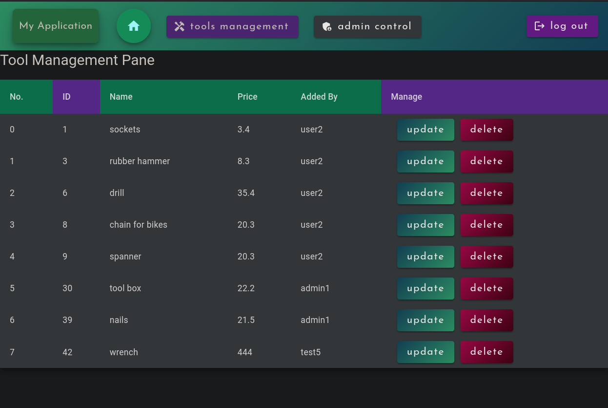

# spring-security-angular-crud
Project to authenticate users with Oauth2/JWT to perform CRUD operations according to roles and permissions

---

This basic project is developed with the purpose of understand how to register, authenticate users, validate tokens and perform **CRUD** operations with the validated user using the following libraries and frameworks:

 **Spring-Boot**:
 - Spring Data JPA
 - mariadb
 - Spring Web
 - Spring Security
 - **Angular** (for the client)

---

